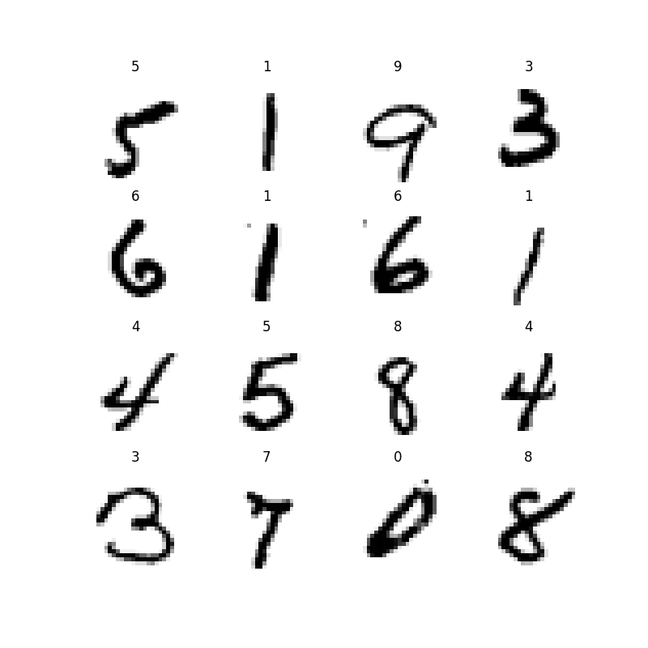

# Building a digit recognizer model

## digit_recognizer.py
Used KNeighbours Classifier, Support Vector Classifier and a Decision Tree Classifier to predict handwritten digits
Checked the accuracy of the three and saved the models as '.p' files using pickle library
KNeighours Classifier had the best accuracy of the three with an accuracy of about 95%

## digit_recog_torch.py
Used a CNN in pytorch to build a model to predict handwritten digits

All used data in datasets directory
All saved models stored in digit_recognizer_models directory

## Examples of digits

